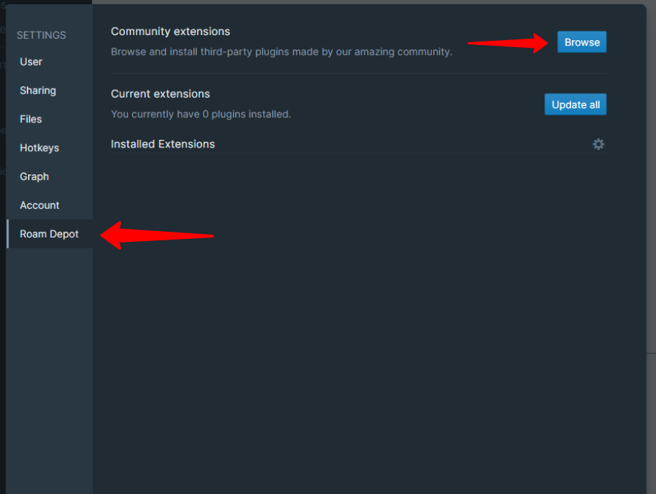

# Discourse Graphs

This extension implements the Discourse Graph protocol, developed by Joel Chan.

To enable the features associated with this protocol, toggle the `Discourse Graphs Enabled` switch.

For more about the suite of tools this mode brings, check out our documentation for how to use this extension at https://oasis-lab.gitbook.io/roamresearch-discourse-graph-extension/.

Contact Joel Chan (joelchan@umd.edu or [@JoelChan86](https://twitter.com/joelchan86) on Twitter or in the `#discourse-graph` channel on the [Academia Roamana Discord](https://discord.gg/FHrtGe25AJt)) for more details!

## Migrate to the Roam Depot Version

The Discourse Graph plugin is bundled with the Query Builder plugin.

To migrate to the new version, you must disable the old version in `roam/js`, then enable it in Query Builder.

### **Step 1**: Uninstall the `roam/js` Discourse Graph

- Open the `[[roam/js]]` page in your graph
- Click on the "Stop this" button. It will look something like:

- The end result should look like this:

**Important:** Once you see that, refresh your page by hitting the refresh button in your browser / device.

Then continue to: Step 2: Install Query Builder

**If you didn't see a yellow "Stop this" button, proceed follow these instructions:**

Find where you have installed Discourse Graph currently via `{{[[roam/js]]}}`. If you are unsure where you have Discourse Graph currently installed you can go to the `[[roam/js]]` page and look through the linked references. It will look something like:

### **Step 2**: Install Query Builder

### Step 3: Enable Discourse Graph within Query Builder

