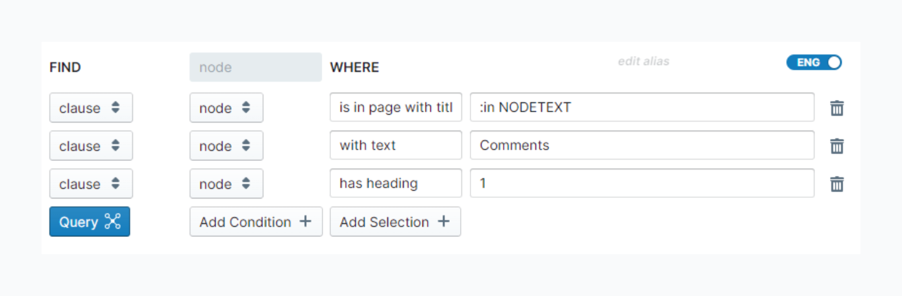
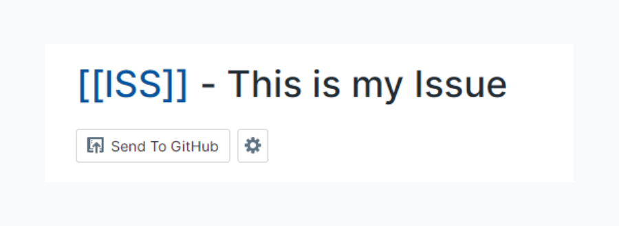

# GitHub Sync

This extension implemnents GitHub Sync, allowing you to synchronize specific pages directly from Roam to a specified GitHub repository as Issues.

## Config Page

This will be found at `[[roam/js/github-sync]]` in your graph.

### Node Select

Select which type of pages you want to sync to GitHub as Issues.

The list is made from defined [Discourse Graph Nodes](discourse-graphs.md).

### Comments Block

This is where the comments will live. A `Add Comment` button will appear on this block as well as a download button.

After you add a comment, that new comment block will have a `Add to GitHub` button to send it to the issue.

Clicking the download button will grab any new comments and open a dialog to confirm adding them to the block.

**Query Block Definition**

Create a `{{query block}}` somewhere in your graph to define which block will be the Comments Block.

You can add the variables `:in NODETEXT` or `:in NODETITLE` which will grab the current pages's text or title.

Then add that Query Block's alias or block reference to the field.

Example:

## Issue Page

### Send To GitHub

When you first navigate to a defined Issue Page, you will see two buttons under the title

Click the Send To GitHub button to start the upload process. The process is as follows:

- install the SamePage GitHub App
- authorize the app to access your GitHub repository
- select the repository you want to send the issue to
- click `Export`

Once this is complete, the title will just show the `GitHub Sync Details Button`. Clicking this button will show additional details about the issue, include a link to the issue, a link to settings, as well as the ability to re-authorize if required.

### Comments

Click the `Add Comment` button to add a comment to the page. Once the comment is created you should see a `Add to GitHub` button. Clicking this will add the comment to the issue. After it is sent, the `Add to GitHub` button should change to a `link` icon which will open the comment on GitHub.

Click the `Download Comments` button to fetch any new comments from the issue. You will see a confirmation dialog of all the comments that will be added.
